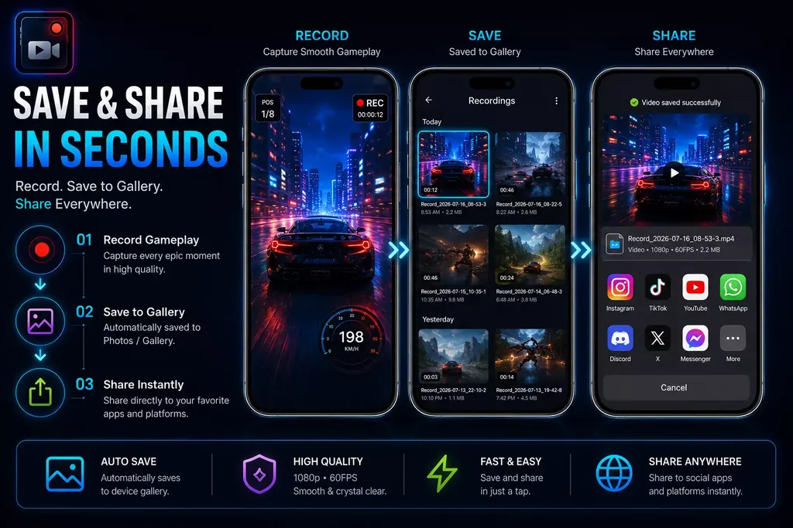
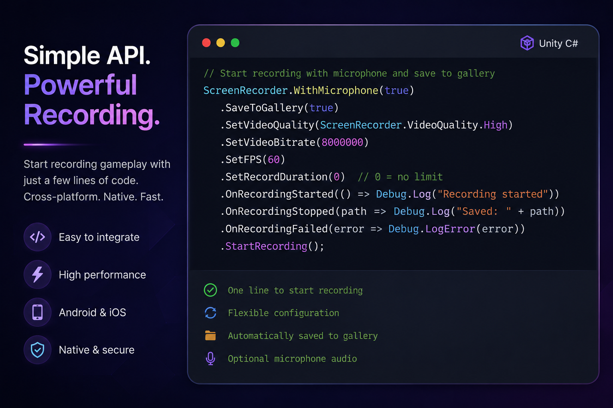

<p align="center">
  
</p>

<h1 align="center">Native Screen Recorder for Unity (Android & iOS)</h1>

<p align="center">
  <strong>Record gameplay. Save it. Share it. One line of code.</strong><br />
  The easiest way to add native screen and gameplay recording to your Unity mobile game.
</p>

<p align="center">
  
  
  
  
  
</p>

<p align="center">
  <a href="https://github.com/oviebd/Unity-Native-Screen-Recorder-For-Android-And-iOS/raw/main/Packages/Native%20Screen%20Recorder%20For%20Android%20And%20iOS%20-%20Free%20_%207.1.0.unitypackage"></a>
  <a href="https://assetstore.unity.com/packages/tools/integration/native-screen-recorder-free-for-unity-android-ios-gameplay-recor-387154"></a>
  <a href="https://assetstore.unity.com/packages/tools/integration/native-screen-recorder-for-android-ios-180403"></a>
  <a href="https://smilesoft.store/docs/native-screen-recorder"></a>
</p>

---

## 🎮 What Is It?

**Native Screen Recorder** is a Unity plugin that records your game screen on **Android** and **iOS** using the phone's own built-in recording engine (Android `MediaProjection` and iOS `ReplayKit`).

That means **smooth gameplay capture, no third-party SDKs, no tokens, no subscriptions**. Drop in a prefab, call `ScreenRecorder.Start()`, and your players can record, save and share their best moments.

---

## 🎬 See It in Action

<p align="center">
  
</p>

<table>
  <tr>
    <td align="center" width="33%">
      <a href="Images/work%20flow.webp"></a>
      <br /><sub><b>Record → Save → Share</b></sub>
    </td>
    <td align="center" width="33%">
      <a href="Images/ui%20show%20case.webp"></a>
      <br /><sub><b>Advanced Recording Settings</b></sub>
    </td>
    <td align="center" width="33%">
      <a href="Images/scripts.png"></a>
      <br /><sub><b>Simple C# API</b></sub>
    </td>
  </tr>
</table>

---

## 📺 Watch the Videos

<table>
  <tr>
    <td align="center" width="50%">
      <a href="https://youtu.be/nOAnnufmZmY"></a>
      <br /><b>▶ Feature Overview</b><br /><sub>See everything the plugin can do</sub>
    </td>
    <td align="center" width="50%">
      <a href="https://youtu.be/iIeCx9_IWX0"></a>
      <br /><b>▶ Setup Tutorial</b><br /><sub>From import to first recording</sub>
    </td>
  </tr>
</table>

---

## ⚡ Quick Start (3 Steps)

**1. Import** the package: **Assets → Import Package → Custom Package** and pick the `.unitypackage`.

**2. Add the recorder** to your scene: **SRecorder → Add Screen Recorder**.

**3. Record** with one line:

```csharp
ScreenRecorder.Start();                                       // start recording
ScreenRecorder.Configure().Stop(path => Debug.Log(path));     // stop and get the video file
```

That's it. Want quality, audio or event options? See the [full documentation](https://smilesoft.store/docs/native-screen-recorder).

---

## 🕹️ Features

- 🔴 **One-line recording**: start and stop gameplay capture with a single call
- 🎙️ **Audio your way**: microphone or in-game system audio (Android)
- 🎚️ **Quality control**: presets from Low to Very High, or custom bitrate, FPS and resolution
- 🖼️ **Save to Gallery / Photos**: videos land right in the player's gallery
- 📤 **Native share sheet**: one tap to TikTok, Instagram, YouTube, WhatsApp and more
- 🗂️ **In-app gallery**: browse, play and delete recordings without leaving the game
- 🎯 **Floating record widget**: a ready-made on-screen record button, no UI work needed
- 📸 **Screenshot widget** *(NEW)*: capture still shots alongside videos
- ⚙️ **Works everywhere**: Built-in, URP and HDRP, IL2CPP and ARM64, Unity 6

---

## 🆚 Free vs Pro

<p align="center">
  
</p>

| Feature | Free | Pro |
|---|:---:|:---:|
| Start / stop recording | ✅ ~5 s cap | ✅ Unlimited |
| Fluent `ScreenRecorder` API | ✅ | ✅ |
| Event system (`RecordingEventDispatcher`) | ✅ | ✅ |
| Auto preview on stop | ✅ | ✅ |
| Microphone audio | ✅ | ✅ |
| System audio (Android) | ❌ | ✅ |
| Recording customization | Defaults only | ✅ Full control |
| Save to Photos / gallery | ❌ | ✅ |
| Custom duration limit | ❌ | ✅ |
| Native video sharing | ❌ | ✅ |
| In-app gallery | ❌ | ✅ |
| Floating record widget | ❌ | ✅ |
| Screenshot widget | ❌ | ✅ *NEW* |

### Which one do I need?

> 🧪 **Free is for development.** Try it in your Unity project, test it on real devices, and make sure it fits your game. Recordings are capped at about 5 seconds.
>
> 🚀 **Pro is for release.** Ship it in commercial and production builds with unlimited recording, gallery, sharing, widgets and full control. It's a one-time purchase.

**Upgrading is seamless.** Import Pro over Free and your existing code keeps working with no changes.

<p align="center">
  <a href="https://assetstore.unity.com/packages/tools/integration/native-screen-recorder-free-for-unity-android-ios-gameplay-recor-387154"></a>
  <a href="https://assetstore.unity.com/packages/tools/integration/native-screen-recorder-for-android-ios-180403"></a>
</p>

---

## 🏆 Perfect For

- **"Share your score"** moments in mobile games
- **Replay clips** for racing, sports, battle and action games
- **Social content** for TikTok, Instagram Reels and YouTube Shorts
- **QA and playtesting** recordings for your team
- **Tutorials and onboarding** walkthroughs

---

## 📋 Requirements

| | Supported |
|---|---|
| **Unity** | 6000.3+ (Unity 6) |
| **Android** | 5.1 (API 22) and newer, including Android 13+ |
| **iOS** | 9.0+ on iPhone and iPad |
| **Render pipelines** | Built-in, URP, HDRP |

---

## 📖 Documentation & Support

Full API reference, setup guides and troubleshooting live in the docs:

**👉 [smilesoft.store/docs/native-screen-recorder](https://smilesoft.store/docs/native-screen-recorder)**

| Need help? | |
|---|---|
| 💬 Discord | [discord.gg/8HXVCdVr](https://discord.gg/8HXVCdVr) |
| 📧 Email | smilesoft4849@gmail.com |
| 🌐 Website | [habiburrahmanovie.com](https://habiburrahmanovie.com/) |
| 🐞 Issues | [Open a GitHub issue](https://github.com/oviebd/Unity-Native-Screen-Recorder-For-Android-And-iOS/issues) |

---

<p align="center">
  
  <br />
  <em>Made with ❤️ for game developers by <a href="https://assetstore.unity.com/publishers/35227">Smile Soft</a></em>
  <br /><br />
  <sub>Unity screen recorder · Unity gameplay recording · Android screen capture · iOS ReplayKit · Android MediaProjection · mobile video recording plugin for Unity</sub>
</p>
