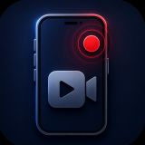

<p align="center">
  
</p>

<h1 align="center">Native Screen Recorder for Android & iOS</h1>

<p align="center">
  <strong>Record gameplay. Save to gallery. Share anywhere — with a single fluent API.</strong>
</p>

<p align="center">
  <a href="https://unity.com"></a>
  <a href="https://assetstore.unity.com/packages/tools/integration/native-screen-recorder-for-android-ios-180403"></a>
  <a href="https://assetstore.unity.com/packages/tools/integration/native-screen-recorder-for-android-ios-180403"></a>
  <a href="https://unity.com/legal/as-terms"></a>
  <a href="https://assetstore.unity.com/packages/tools/integration/native-screen-recorder-for-android-ios-180403"></a>
</p>

<p align="center">
  <a href="#-quick-start">Quick Start</a> ·
  <a href="#-features">Features</a> ·
  <a href="#-free-vs-pro">Free vs Pro</a> ·
  <a href="#-installation">Installation</a> ·
  <a href="#-api-reference">API</a> ·
  <a href="#-documentation--support">Support</a>
</p>

---

Cross-platform Unity screen recording powered by **native OS APIs** — Android's `MediaProjection` + Foreground Service and iOS's `ReplayKit`. No third-party SDKs. No tokens. No subscriptions. Drop in the prefab, call one line of code, and ship.

| Platform | Minimum Version | Native Technology |
|---|---|---|
| **Android** | 5.1 (API 22), including Android 13+ | MediaProjection + Foreground Service |
| **iOS** | 9.0+ (iPhone, iPad, iPod Touch) | ReplayKit |

---

## ✨ Why Developers Choose This Plugin

- **Zero-code setup** — drop in the prefab and you're recording
- **One-line fluent API** — configure quality, audio, storage, and duration in a single chain
- **Real-time event system** — know exactly when recording starts, progresses, completes, or fails
- **Zero dependencies** — OS-native encoding with minimal performance impact
- **Built-in, URP & HDRP compatible** — works with every Unity render pipeline
- **Tiny footprint** — lightweight plugin that won't bloat your project
- **Active maintenance** — updated for Unity 6 (6000.3+) and latest mobile OS versions

---

## ⚡ Quick Start

```csharp
// Minimal — start with defaults
ScreenRecorder.Start();

// Typical — configure then record
ScreenRecorder.Configure()
    .WithAudioMode(SmileSoftScreenRecordController.AudioRecordingMode.MicAudio)
    .WithQuality(RecordingQuality.High)
    .WithFileName("MyClip")
    .Start();

// Stop — saved file path returned in callback
ScreenRecorder.Configure().Stop(path => Debug.Log($"Saved to: {path}"));
```

> All configuration methods must be called **before** `Start()`.

---

## 🖼 Features

<p align="center">
  
</p>

<table>
  <tr>
    <td width="50%" valign="top">
      
      <br /><br />
      <strong>Simple API. Powerful Recording.</strong><br />
      Start recording with a fluent builder chain. Cross-platform, native, and fast — no boilerplate required.
    </td>
    <td width="50%" valign="top">
      
      <br /><br />
      <strong>Powerful Recording Settings.</strong><br />
      Customize quality, audio source, bitrate, FPS, duration limits, and save destinations from code or the Inspector.
    </td>
  </tr>
  <tr>
    <td width="50%" valign="top">
      
      <br /><br />
      <strong>Manage Recordings.</strong> <em>(Pro)</em><br />
      View, play, share, and delete all recordings in a built-in in-game gallery.
    </td>
    <td width="50%" valign="top">
      <br />
      <strong>Floating Record Widget.</strong> <em>(Pro)</em><br />
      Drop a ready-made on-screen record button onto any Canvas — one tap to start or stop. No custom UI to build.
    </td>
  </tr>
</table>

### Recording

- Start and stop with a single method call
- Captures everything visible — game view, UI overlays, and HUD — exactly as the player sees it
- Quality presets for Android: `Low`, `Medium`, `High`, `VeryHigh`, or fully `Custom`
- Auto-stop after a duration limit *(Pro)*

### Audio

| Mode | Android | iOS |
|---|:---:|:---:|
| No audio | ✅ | ✅ |
| Microphone | ✅ | ✅ |
| System / in-game audio | ✅ *(Pro)* | ❌ |

### Pro-Only Features

| Feature | Description |
|---|---|
| **In-App Gallery** | Browse, play, share, and delete recordings without leaving your game |
| **Recording Widget** | Floating on-screen record button — configure via Inspector or runtime code |
| **Duration Limit** | Auto-stop after N seconds (`WithDurationLimit`) |
| **Save to Gallery / Photos** | Persist recordings to the device gallery |
| **Native Share** | One tap to the OS share sheet — social, messaging, anywhere |
| **Full Customization** | Bitrate, FPS, encoder, resolution, folder, and file name control |

---

## 🆓 Free vs Pro

| Feature | Free | Pro |
|---|:---:|:---:|
| Start / stop recording | ✅ (~5 s cap) | ✅ Unlimited |
| Fluent `ScreenRecorder` API | ✅ | ✅ |
| Event system (`RecordingEventDispatcher`) | ✅ | ✅ |
| Auto preview on stop | ✅ | ✅ |
| Microphone audio | ✅ | ✅ |
| System audio (Android) | ❌ | ✅ |
| Recording customization | Defaults only | ✅ Full control |
| Save to Photos / gallery | ❌ | ✅ |
| Custom duration limit | ❌ | ✅ |
| Native video sharing | ❌ | ✅ |
| In-app gallery | ❌ | ✅ |
| Floating record widget | ❌ | ✅ |

**The free version is fully functional for testing and prototyping.** Upgrade to [Pro on the Asset Store](https://assetstore.unity.com/packages/tools/integration/native-screen-recorder-for-android-ios-180403) when you're ready to ship.

### Upgrade to Pro — One-Time Purchase

**[→ Get Pro on the Unity Asset Store](https://assetstore.unity.com/packages/tools/integration/native-screen-recorder-for-android-ios-180403)**

1. Purchase on the Unity Asset Store
2. Import the `.unitypackage` into your existing project
3. Pro activates automatically — it overrides the free version seamlessly

> **Zero extra code required.** Your existing API calls work identically. Pro removes the 5-second cap and unlocks gallery, sharing, widget, and full customization.

---

## 📦 Installation

### Free Version (GitHub)

| Version | Unity | Release Date | Download |
|---|---|---|---|
| **v7.0.0** ⭐ *(Latest)* | 6000.3+ | July 16, 2026 | [Download `.unitypackage`](https://github.com/oviebd/Unity-Native-Screen-Recorder-For-Android-And-iOS/blob/main/Packages/Native%20Screen%20Recorder%20For%20Android%20And%20iOS%20-%20Free%20_%207.0.0.unitypackage) |
| v6.0.0 | 6000.3+ | June 16, 2026 | [Download `.unitypackage`](https://github.com/oviebd/Unity-Native-Screen-Recorder-For-Android-And-iOS/blob/main/Packages/Native%20Screen%20Recorder%20For%20Android%20And%20iOS%20-%20Free%20_%206.0.0.unitypackage) |

**Steps:**

1. Download the latest `.unitypackage` (v7.0.0) above
2. In Unity: **Assets → Import Package → Custom Package**
3. Import all files
4. Add the recorder via menu: **SRecorder → Add Screen Recorder**  
   Or drag `SunShine Native Screen Recorder/Core/Prefab/Screen Recorder.prefab` into your scene

> The GameObject **must be named exactly `Screen Recorder`** — required for iOS and Android callbacks.

**Optional — Recording Widget** *(Pro only):*  
**SRecorder → Add Record Widget** or drag `Features/RecordingWidget/Prefabs/RecordingWidget.prefab` onto your Canvas.

**Android file provider** *(only if using native share):*  
Set `android:authorities` in `AndroidManifest.xml` and match the `_fileProvider` field in `SmileSoftScreenRecordController.cs`.

---

## 📖 API Reference

### Fluent Builder API *(recommended)*

All methods are called on `ScreenRecorder.Configure()` unless noted.

```csharp
// ── Audio (use ONE) ─────────────────────────────────────
.WithAudioMode(SmileSoftScreenRecordController.AudioRecordingMode.MicAudio)
// NoAudio | SystemAudio (Android) | MicAudio

// ── Quality — Android only (ignored on iOS) ─────────────
.WithQuality(RecordingQuality.High)
// Low | Medium | High | VeryHigh | Custom

// ── Custom Android encoding (with Custom quality) ───────
.WithBitrate(10_485_760)
.WithFps(30)
.WithVideoEncoder(SmileSoftScreenRecordController.VideoEncoder.H264)
.WithVideoRotation(0)          // 0 | 90 | 180 | 270
.WithVideoSize(1920, 1080)

// ── Storage ─────────────────────────────────────────────
.WithFolderName("MyClips")
.WithFileName("Clip_001")
.SaveToGallery(true)           // Pro
.SaveToDocuments(true)         // iOS — Pro

// ── Pro-only ────────────────────────────────────────────
.WithDurationLimit(30)         // 0 = unlimited
.WithAutoPreview(true)

.Start();
Stop(path => Debug.Log(path));
```

#### Android Quality Presets

| Quality | Bitrate | FPS |
|---|---|---|
| Low | 2,621,440 | 24 |
| Medium | 5,242,880 | 24 |
| High | 10,485,760 | 30 |
| Very High | 16,777,216 | 60 |

### Event System

Subscribe via `RecordingEventDispatcher.Instance` in `OnEnable` and unsubscribe in `OnDisable`.

| Event | Fires when… |
|---|---|
| `RecordingStarted` | Native layer confirms recording is live |
| `StateChanged` | Any state transition — drive all UI from one handler |
| `ProgressChanged` | Elapsed / remaining time (~every 0.25 s while recording) |
| `RecordingCompleted` | File saved successfully (path in `RecordingResult`) |
| `RecordingFailed` | Start or save failed |
| `ErrorOccurred` | Normalized error — permission denied, Pro blocked, etc. |

```csharp
void OnEnable()
{
    var d = RecordingEventDispatcher.Instance;
    d.RecordingStarted  += () => recordBtn.text = "Stop";
    d.ProgressChanged   += p => timer.text = p.ElapsedSeconds.ToString("F0");
    d.RecordingCompleted += r => ShowSuccess(r.VideoPath);
    d.RecordingFailed   += r => ShowError(r.Error?.Message);
    d.ErrorOccurred     += e => HandleError(e.Code, e.Message);
}
```

### Gallery API *(Pro)*

| Member | Description |
|---|---|
| `GetAllVideos()` | Returns all recorded videos |
| `Refresh()` | Reloads gallery index and removes missing files |
| `TryDeleteVideo(path, out error)` | Deletes file and database entry |
| `FindVideoByPath(path)` | Looks up one entry by path |
| `OnVideosChanged` | Fires when videos are added, deleted, or refreshed |

### Recording Widget *(Pro)*

Configure via Inspector (no code) or override at runtime:

```csharp
// Quick override
recordingWidget.Configure(
    enableMicrophone: true,
    quality: RecordingQuality.High,
    durationLimitSeconds: 30,
    saveToGallery: true);

// Full runtime override
recordingWidget.SetConfiguration(new RecordingWidgetConfiguration
{
    AudioMode = SmileSoftScreenRecordController.AudioRecordingMode.MicAudio,
    RecordingQuality = RecordingQuality.High,
    Bitrate = 10_485_760,
    Fps = 30,
    SaveToGallery = true,
    FolderName = "MyClips",
    FileName = "Highlight_01",
    DurationLimit = 45,
    AutoPreview = true
});

recordingWidget.ClearConfiguration(); // restore prefab defaults
```

### Legacy API *(backward compatible)*

Retained for pre-7.0 integrations. New projects should use the fluent `ScreenRecorder` API above.

```csharp
SmileSoftScreenRecordController.instance.StartRecording();
SmileSoftScreenRecordController.instance.StopRecording();
SmileSoftScreenRecordController.instance.SetAudioRecordingMode(mode);
SmileSoftScreenRecordController.instance.SetBitRate(5242880);
SmileSoftScreenRecordController.instance.SetVideoSize(1080, 1920);
SmileSoftScreenRecordController.instance.PreviewVideo(filePath);   // Pro
SmileSoftScreenRecordController.instance.ShareVideo(path, msg, title); // Pro
```

Static events on `SmileSoftScreenRecordController` remain available. Prefer `RecordingEventDispatcher` for new code.

---

## 🎯 Common Use Cases

- **"Share your score"** flows in mobile games
- Post-match replay clips for battle, sports, or racing games
- Social sharing to TikTok, Instagram Reels, and YouTube Shorts
- In-app QA recording for internal playtesting builds
- Tutorial capture and onboarding walkthroughs

---

## 🗺 Platform Compatibility

| Platform | Min Version | Render Pipelines |
|---|---|---|
| Android | 5.1 (Lollipop) — Android 13+ | Built-in, URP, HDRP |
| iOS | iPhone / iPad / iPod Touch · iOS 9.0+ | Built-in, URP, HDRP |

> **Not supported:** Desktop, WebGL, macOS, AR face-tracking compositing, or recording specific cameras/textures (screen-only capture).

### Troubleshooting

**Android**
- Set **Project Settings → Android → Other Settings → Application Entry Point** to **Game Activity**
- If not using Game Activity, remove the `UnityPlayerGameActivity` section from the manifest

**iOS**
- For sharing, only `filePath` and `message` are used — everything else is auto-configured
- `dyld: Library not loaded: @rpath/libswiftCore.dylib` → set **Always Embed Swift Standard Libraries** to **Yes** in Xcode Build Settings

> For a complete working example, open **Assets → SunShine Native Screen Recorder → Example → Example Scene**.

---

## ⭐ What Pro Users Are Saying

> *"Works perfectly on both platforms. The setup was surprisingly painless — had it running in minutes."*

> *"Exactly what I needed. Native APIs mean no performance hit during recording. My players love the share feature."*

> *"Clean API, well documented, responsive support. Highly recommended for any mobile game that wants social sharing."*

---

## 📖 Documentation & Support

| Resource | Link |
|---|---|
| Full Online Documentation | [smilesoft.store/docs/native-screen-recorder](https://smilesoft.store/docs/native-screen-recorder) |
| Pro Version (Asset Store) | [Unity Asset Store](https://assetstore.unity.com/packages/tools/integration/native-screen-recorder-for-android-ios-180403) |
| Discord Community | [discord.gg/8HXVCdVr](https://discord.gg/8HXVCdVr) |
| Developer Website | [habiburrahmanovie.com](https://habiburrahmanovie.com/) |
| Email | smilesoft4849@gmail.com |

Issues and questions? Open a GitHub issue or post in Discord — responses within 48 hours.

---

<p align="center">
  
  <br /><br />
  <em>Made with care by <a href="https://assetstore.unity.com/publishers/35227">Smile Soft</a></em>
</p>
